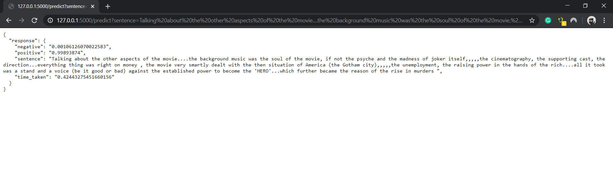

# Movies Reviews Sentiment Model Using BERT and Serving it with Flask API

## Introduction

My goal for this project was learn how to build and deploy a production-grade movies reviews sentiment model using BERT model serving it with Flask API. Users are able to send text to the model, via an API, and get back predictions on local server. 
## Dataset
I have used [large movie review dataset](https://ai.stanford.edu/~amaas/data/sentiment/), this is a dataset for binary sentiment classification containing substantially more data than previous benchmark datasets. We provide a set of 25,000 highly polar movie reviews for training, and 25,000 for testing. There is additional unlabeled data for use as well. Raw text and already processed bag of words formats are provided.

## Bert Model
BERT [(Bidirectional Encoder Representations from Transformers)](https://arxiv.org/pdf/1810.04805.pdf) is a recent paper published by researchers at Google AI Language. It has caused a stir in the Machine Learning community by presenting state-of-the-art results in a wide variety of NLP tasks, including Question Answering (SQuAD v1.1), Natural Language Inference (MNLI), and others.

BERT’s key technical innovation is applying the bidirectional training of Transformer, a popular attention model, to language modelling. This is in contrast to previous efforts which looked at a text sequence either from left to right or combined left-to-right and right-to-left training. The paper’s results show that a language model which is bidirectionally trained can have a deeper sense of language context and flow than single-direction language models. In the paper, the researchers detail a novel technique named Masked LM (MLM) which allows bidirectional training in models in which it was previously impossible.

## BERT Fine-Tuning With PyTorch
I'll use BERT with the huggingface PyTorch library to quickly and efficiently fine-tune a model to get near state of the art performance in sentence classification. More broadly, I describe the practical application of transfer learning in NLP to create high performance models with minimal effort on a range of NLP tasks. Specifically, we will take the pre-trained BERT model, add an untrained layer of neurons on the end, and train the new model for our classification task. 

## Flask API App

